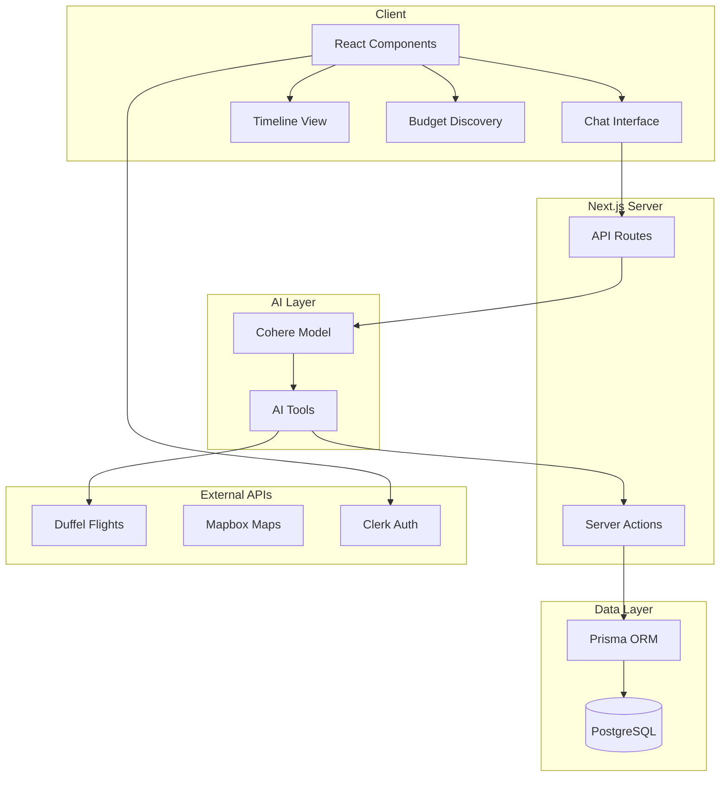
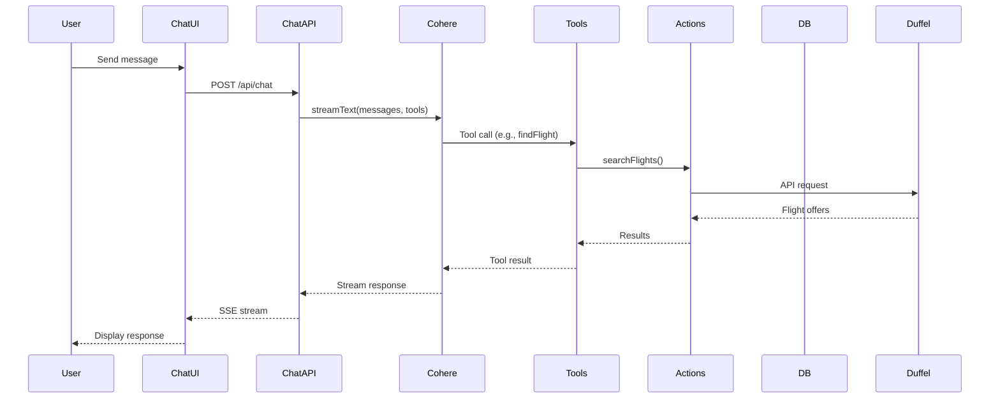

# Travelers Architecture

## Overview

Travelers is an AI-powered travel planning application built with Next.js 15, React 19, and a PostgreSQL database. Users can create trips, search for flights and accommodations via natural language chat, and manage hierarchical itineraries.

## High-Level Structure

## Data Flow

### Chat Request Flow

### Trip and Timeline Flow

1. User creates trip via `create-trip` action
2. Trip gets a Timeline (one-to-one)
3. AI tools (e.g., `addToTimeline`) create TimelineItems
4. TimelineItems can have children, alternatives, and locations
5. Bookings link to trips and store flight/hotel confirmation data

## Key Modules

| Module | Path | Purpose |
|--------|------|---------|
| Database | `lib/db/` | Prisma client, user/trip/timeline/booking helpers |
| AI Tools | `lib/tools/` | findFlight, findStay, addToTimeline, budgetDiscovery, etc. |
| Server Actions | `app/actions/` | create-trip, add-to-timeline, flight-search, stay-search, etc. |
| Chat API | `app/api/chat/route.ts` | Streams AI responses with tool calling |
| UI Components | `components/ui/` | Chat, timeline, flight forms, budget discovery |

## Prisma Schema Overview

- **User** — Clerk sync, preferences, trips, bookings, pending flights
- **Trip** — Title, destination, dates, status; has Timeline and Bookings
- **Timeline** — One per trip; has TimelineItems and TimelineLocations
- **TimelineItem** — Flights, stays, activities; hierarchical (parent/children); has alternatives
- **TimelineLocation** — Airports, cities, hotels for map/timeline display
- **Booking** — Flight/hotel bookings with external IDs
- **PendingFlight** — Parsed flight emails awaiting user assignment to trips

## External Integrations

- **Clerk** — Authentication, user profile
- **Duffel** — Flight search and booking
- **Mapbox** — Map display for trip locations

## Environment Variables

| Variable | Purpose |
|----------|---------|
| `DATABASE_URL` | PostgreSQL connection |
| `NEXT_PUBLIC_CLERK_*` / `CLERK_*` | Clerk auth |
| `DUFFEL_ACCESS_TOKEN` | Duffel API |
| `NEXT_PUBLIC_MAPBOX_ACCESS_TOKEN` | Mapbox maps |
